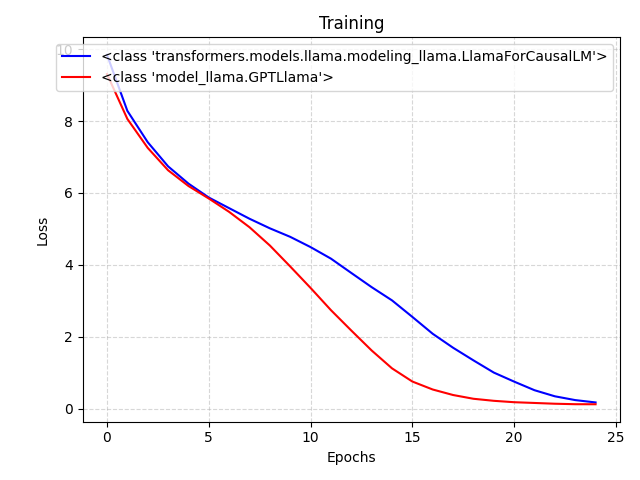

# build-gpt

* Based on: https://github.com/karpathy/build-nanogpt

A PyTorch library with educational re-implementation of models: **LLaMA**, **GPT** included both training and inference. Code tries to be small, clean and interpretable, as most of the currently available [GPT](model_gpt2.py) model implementations can a bit sprawling. Code focused on implementation of [GPTLlama](model_llama.py), that is not a complicated model and this implementation is appropriately about 350 lines of code.


### Demos:

* [fineweb.py](fineweb.py): build tokenized `edu_fineweb10B` dataset.
* [main_ddp.py](main_ddp.py]): train model `edu_fineweb10B` (`ddp` mode).
* [main.py](main.py): train model on `edu_fineweb10B` (`single-GPU` mode).
* [compare_llama.py](compare_llama.py): compare llama models and build graph





### Testing models:

* [test_models.py](compare_llama.py): testing models functionality (**gpt2**, **llama** with tokenizers **gpt2** or **noomo**).


### Implemented models:

* [**GPT**](model_gpt2.py): standard nanoGPT model.
* [**GPTLlama**](model_llama.py): GPT model with simple RoPE, RMSNorm-trainable, SWiGLU.


### Additionally:
* [fineweb_gpt.py](fineweb_gpt.py)              : build dataset from trained tokenizer
* [fineweb_statistics.py](fineweb_statistics.py): tokens statistic of local dataset **Wikipedia 20220301.en** (`parquet` shards)
* [train_tokenizer.py](train_tokenizer.py)      : train custom tokenizer
* [compare_tokenizers.py](compare_tokenizers.py): comparing tokenizers by quality
<br>

| Tokenizer             |     Tokens      |   size   |
|-----------------------|-----------------|----------|
| gpt2                  |  9_953_989_344  |  50_257  |
| gpt-neo-125m          |  9_953_989_333  |  50_257  |
| noomo                 |  9_843_922_538  |  40_260  |
| gpt-noomo             |  9_842_205_029  |  40_264  |
| noomo-32k             | 10_006_603_852  |  32_258  |
| gpt-noomo-32k         | 10_004_601_430  |  32_264  |
<br>

### Tokenizers

The **gpt-noomo-32k** tokenizer is extention of **noomo-32k**.

Additional special tokens to **gpt-noomo-32k**:
```
    <|system|>
    <|user|>
    <|assistant|>
    <|knowledge|>
    <|instruction|>
    ###
```

* USER = QUESTION
* ASSISTANT = ANSWER
* KNOWLEDGE = CONTEXT


## Wikipedia dataset
Download **20220301.en** shard of [legacy-datasets/wikipedia](https://huggingface.co/datasets/legacy-datasets/wikipedia) dataset:
```bash
hf download legacy-datasets/wikipedia --repo-type dataset --include "data/20220301.en/*" --local-dir ./datasets/wikipedia_20220301_en
```

* Rows: 6_458_670
* GPT2 full tokens: 4_640_971_626
* GPT2 tokens(CLAMP=1023): 2_878_960_514
